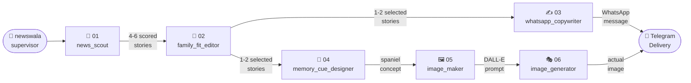

# 🐾 NewsWala — Agent Directory

> Six specialists. One family. Every morning.

---

## Pipeline



---

## The Team

| # | Agent | Persona | Model | Editable? | ~Daily Cost |
|---|-------|---------|-------|-----------|-------------|
| 1 | [📡 news_scout](./01_news_scout/) | Senior investigative journalist — obsessive about freshness and India | `claude-sonnet-4-6` | ✅ Yes | ~$0.03 |
| 2 | [🧐 family_fit_editor](./02_family_fit_editor/) | Protective editor — guards the family's attention like a parent | `claude-haiku-4-5` | ✅ Yes | ~$0.003 |
| 3 | [✍️ whatsapp_copywriter](./03_whatsapp_copywriter/) | Warm family writer — writes like Yash & Pooja talk to their daughters | `claude-sonnet-4-6` | ✅ Yes | ~$0.01 |
| 4 | [🎨 memory_cue_designer](./04_memory_cue_designer/) | Visual storyteller — turns news into a dog image memory | `claude-haiku-4-5` | ✅ Yes | ~$0.001 |
| 5 | [🖼️ image_maker](./05_image_maker/) | Prompt engineer — writes the perfect DALL-E 3 instructions | `claude-haiku-4-5` | ✅ Yes | ~$0.001 |
| 6 | [🎭 image_generator](./06_image_generator/) | Illustrator — actually generates the Hergé/Tintin image | `DALL-E 3 (OpenAI)` | ✅ Yes | ~$0.04 |

**Total: ~$0.085/day → ~$2.55/month** _(well within the $5 budget)_

---

## How to Edit an Agent

1. Open the agent's folder (e.g. [`03_whatsapp_copywriter/`](./03_whatsapp_copywriter/))
2. Read `README.md` to understand the agent's persona and how they talk
3. Open `system_prompt.txt` — this is the **exact instructions Claude receives**
4. Edit and save — changes take effect on the **next run** (no Python needed)

## How to Add a New Agent

1. Create a new folder: `07_your_agent_name/`
2. Add `README.md` (copy any existing one as template)
3. Add `system_prompt.txt` with the agent's instructions
4. Wire it into `agents.py` by adding a new function that calls `_load_prompt("07_your_agent_name")`
5. Call it in `supervisor.py` at the right step in the pipeline

---

## Handoff Protocols

| From → To | What's passed | Format |
|-----------|---------------|--------|
| supervisor → news_scout | Run date | `YYYY-MM-DD` string |
| news_scout → family_fit_editor | Candidate stories | JSON array of 4-6 objects |
| family_fit_editor → whatsapp_copywriter | Selected stories | JSON array of 1-2 objects |
| family_fit_editor → memory_cue_designer | Selected stories | JSON array of 1-2 objects |
| memory_cue_designer → image_maker | Visual concept | JSON object |
| image_maker → image_generator | DALL-E 3 prompt | Plain string |
| image_generator → supervisor | Image URL | Plain string (or empty if skipped) |

---

## Budget Tracker

```
Claude API (daily)
  news_scout        Sonnet 4.6   ~$0.030
  family_fit_editor Haiku  4.5   ~$0.003
  whatsapp_copywriter Sonnet 4.6 ~$0.010
  memory_cue_designer Haiku 4.5  ~$0.001
  image_maker       Haiku  4.5   ~$0.001
  ─────────────────────────────────────
  Claude subtotal               ~$0.045

OpenAI DALL-E 3 (daily)
  image_generator   1024×1024    ~$0.040
  ─────────────────────────────────────
  DALL-E subtotal               ~$0.040

TOTAL/day                       ~$0.085
TOTAL/month (30 days)           ~$2.55
Budget                          $5.00 ✅
```
